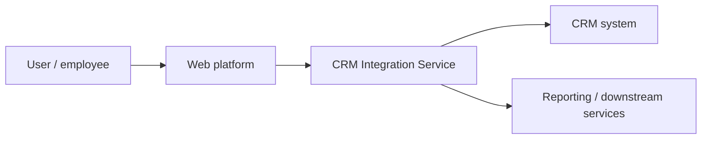

# CRM Integration Architecture

[](https://github.com/theDAREK497/crm-integration-architecture/actions/workflows/ci.yml)

A compact architecture showcase for integrating a CRM with web or internal business systems.

The repository combines **C4-style architecture documentation**, a minimal executable **FastAPI** service and **Docker** packaging.

> **Scope:** architecture/demo repository. The small API exists to make the design executable; it is not presented as a complete production CRM integration.

## What this project demonstrates

- separating architecture documentation from implementation details;
- C4-style system decomposition;
- REST API boundary design;
- typed request/response models with FastAPI and Pydantic;
- containerization with Docker;
- automated API tests, code quality and dependency security checks;
- keeping an architecture example small enough to inspect quickly.

## Architecture

The detailed architecture notes live in:

- [`docs/architecture.md`](docs/architecture.md)
- [`docs/c4-diagrams/`](docs/c4-diagrams/)

The repository describes multiple levels of the system:

1. **Context** — users, the CRM and the consuming web/internal platform.
2. **Container / component view** — integration service responsibilities such as authentication, synchronization and reporting.
3. **Code-level example** — a minimal FastAPI service.



## Executable example

The current FastAPI application intentionally exposes a very small API:

```http
GET /users
```

It returns typed example user records and provides automatic Swagger/OpenAPI documentation.

This keeps the code focused on the integration boundary while the repository's primary value remains the architecture material.

## Tech stack

- Python 3.11
- FastAPI
- Pydantic
- Pytest
- Ruff / Bandit / pip-audit
- Mermaid / C4-style diagrams
- Docker
- GitHub Actions

## Run locally

```bash
git clone https://github.com/theDAREK497/crm-integration-architecture.git
cd crm-integration-architecture
```

Build:

```bash
docker build -t crm-integration-service .
```

Run:

```bash
docker run --rm -p 8000:8000 crm-integration-service
```

Open the API documentation:

```text
http://localhost:8000/docs
```

## Validation

Install development dependencies and run:

```bash
python -m pip install -r requirements-dev.txt
ruff check src tests
python -m pytest -q
bandit -r src -q
pip-audit -r src/requirements.txt
```

CI also verifies that the Docker image builds successfully.

## Repository structure

```text
src/
  main.py             minimal FastAPI example
  requirements.txt    runtime dependencies
tests/
  test_api.py         API contract smoke tests
requirements-dev.txt  development and quality tooling
docs/
  architecture.md     architecture description
  c4-diagrams/        architecture diagrams
Dockerfile            container definition
```

## What a production version would add

A real CRM integration would normally require concerns that are intentionally outside this small showcase:

- authentication and authorization;
- secrets management;
- idempotent synchronization;
- retries and dead-letter handling;
- webhooks/event processing;
- observability and audit logs;
- persistent state;
- contract/integration testing;
- reconciliation jobs.

## License

MIT. See [LICENSE](LICENSE).
